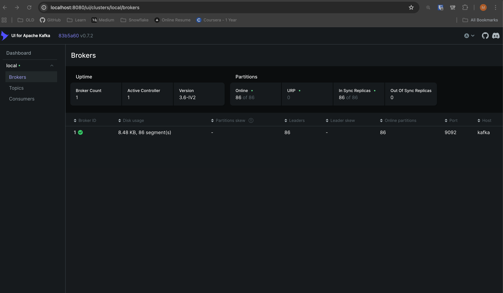
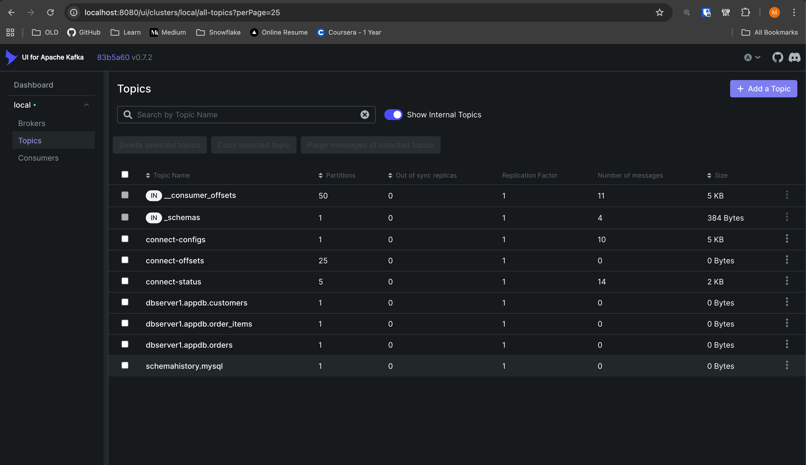
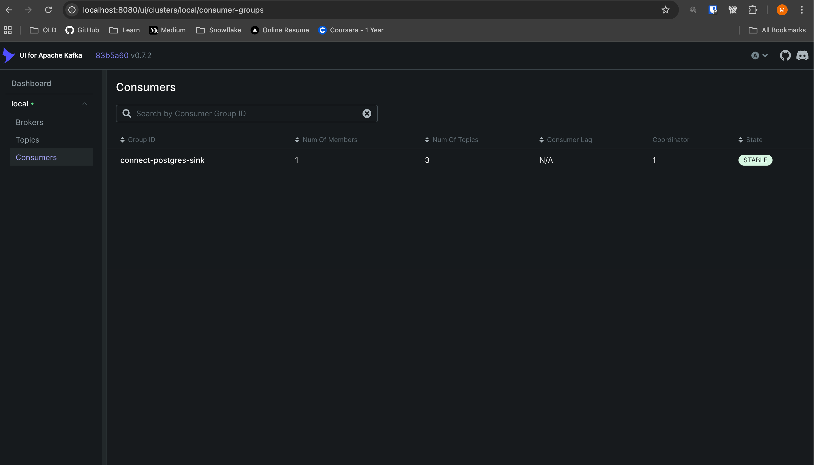

# DevSecOps CDC Demo (MySQL -> Postgres)

## Overview
This repo spins up a local CDC pipeline using Docker Compose:
- MySQL is the source database with 3 tables: `customers`, `orders`, `order_items`.
- Debezium reads MySQL binlog changes and publishes them to Kafka topics.
- A JDBC sink connector consumes those topics and writes changes into Postgres.
- Kafka UI lets you browse topics and see changes in real time.
- Secrets live in `.secrets/secrets.env` and never appear in `docker-compose.yml`.

## Architecture (high level)
1) MySQL emits binlog changes.
2) Debezium Kafka Connect publishes events to Kafka topics.
3) JDBC Sink Connect writes the events into Postgres.
4) Kafka UI lets you inspect topics and messages.

Kafka topic prefix: `dbserver1.appdb.*`

## Prerequisites
- Docker Desktop (or Docker Engine) with Compose v2.
- Open ports: `3306`, `5432`, `8080`, `8081`, `8083`, `9092`.
- `curl` (for connector checks).
- `jq` (optional, but makes connector output readable).
- `python3` (used by scripts if `envsubst` is unavailable).

## Project layout
- `docker-compose.yml`: service definitions.
- `connect/`: Kafka Connect image with required plugins.
- `connectors/`: connector templates (no secrets).
- `mysql/`: binlog config, schema, seed data.
- `postgres/`: target schema.
- `scripts/`: run/init/check helpers.
- `.secrets/`: local secrets and rendered connector configs (gitignored).

## Quick start (the "initiate" button)
From the repo root:
```
./scripts/init.sh
```
This will:
- Create `.secrets/secrets.env` if it does not exist.
- Start all services.
- Register MySQL source + Postgres sink connectors.

## Verify it is running
Check containers:
```
docker compose ps
```

Check registered connectors:
```
curl -s http://localhost:8083/connectors | jq
```

## Add data and verify CDC
Insert new rows into MySQL (triggers CDC):
```
./scripts/add-data.sh
```

Verify data landed in Postgres:
```
./scripts/check.sh
```

Inspect CDC events:
- Kafka UI: http://localhost:8080
- Topics:
  - `dbserver1.appdb.customers`
  - `dbserver1.appdb.orders`
  - `dbserver1.appdb.order_items`

## Screenshots (Kafka UI)
Captured after `./scripts/init.sh` and initial snapshot completion.

**Brokers**
- Shows 1 broker, active controller = 1, version 3.6-IV2.
- Partition health: 86 online, 0 URP, 86 in-sync, 0 out-of-sync.



**Topics**
- Internal topics plus CDC topics `dbserver1.appdb.customers`, `dbserver1.appdb.orders`, `dbserver1.appdb.order_items`.
- Connector topics like `connect-configs`, `connect-offsets`, `connect-status` are present.



**Consumers**
- Consumer group `connect-postgres-sink` with 1 member, 3 topics, state `STABLE`.



## Seeded data (initial snapshot)
- `customers`: 100 rows
- `orders`: 2,000 rows
- `order_items`: 10,000 rows

## Services and ports
- MySQL: `localhost:3306`
- Postgres: `localhost:5432`
- Kafka: `localhost:9092`
- Kafka Connect: `localhost:8083`
- Schema Registry: `localhost:8081`
- Kafka UI: `localhost:8080`

## Secrets
Local secrets are stored in `.secrets/secrets.env`:
- `MYSQL_ROOT_PASSWORD`
- `MYSQL_USER`
- `MYSQL_PASSWORD`
- `POSTGRES_USER`
- `POSTGRES_PASSWORD`

Edit `.secrets/secrets.env` before running if you want different values.

## Re-register connectors
If you edit a connector template, re-register:
```
./scripts/register-connectors.sh
```

## Reset
To stop and clear all data:
```
docker compose down -v
```

## Troubleshooting
- Kafka UI shows no brokers: check Kafka is running with `docker compose ps`.
- Connect not ready: `docker compose logs --tail=200 connect`.
- Schema Registry issues: `docker compose logs --tail=200 schema-registry`.
